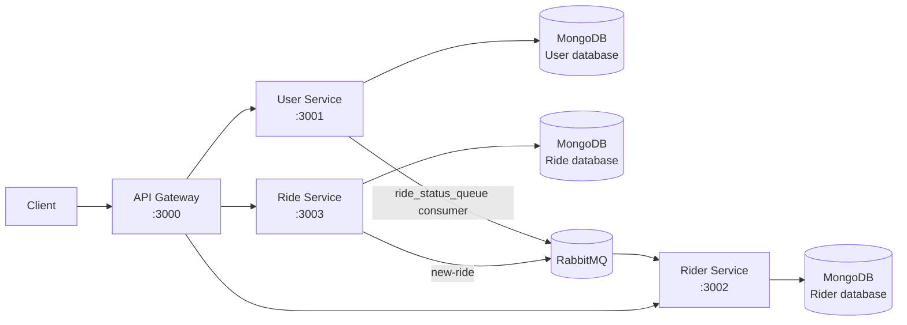

# UBER Ride-Sharing Backend

A Node.js microservices backend for a ride-sharing application. The project separates user management, rider management, and ride management into independent Express services. An API Gateway provides one public entry point, while RabbitMQ is used for asynchronous ride notifications.

## Architecture



### Services

| Component | Port | Responsibility |
| --- | ---: | --- |
| Gateway | `3000` | Proxies `/user`, `/rider`, and `/ride` requests to the appropriate service |
| User service | `3001` | User registration, login, logout, profile, and ride-status long polling |
| Rider service | `3002` | Rider registration, login, logout, profile, availability, and new-ride long polling |
| Ride service | `3003` | Ride creation and ride-status updates |

Each service has its own Express app, server entry point, MongoDB connection module, models, routes, and environment configuration. The services use CommonJS modules.

## Request Flow

1. A client sends a request to the gateway on port `3000`.
2. The gateway forwards the request based on its URL prefix:
   - `/user/*` to `http://localhost:3001`
   - `/rider/*` to `http://localhost:3002`
   - `/ride/*` to `http://localhost:3003`
3. The target service authenticates the request when the route requires it.
4. The service reads or writes its MongoDB data.
5. Ride creation publishes a JSON message to the durable RabbitMQ queue `new-ride`.
6. Riders waiting on `/rider/available-rides` receive the new ride notification.

## Technology Stack

- Node.js
- Express 5
- MongoDB with Mongoose
- RabbitMQ with `amqplib`
- JWT authentication with `jsonwebtoken`
- Password hashing with `bcrypt`
- HTTP proxying with `express-http-proxy`
- Environment loading with `dotenv`

## Prerequisites

- Node.js 18 or newer
- npm
- A MongoDB instance
- A RabbitMQ instance

## Configuration

Create a `.env` file in each service directory. `.env` files are ignored by Git and must be configured locally.

### User service: `user/.env`

```env
MONGO_URI=mongodb://localhost:27017/uber_users
JWT_SECRET=replace-with-a-long-random-secret
RABBITMQ_URL=amqp://localhost
```

### Rider service: `rider/.env`

```env
MONGO_URI=mongodb://localhost:27017/uber_riders
JWT_SECRET=replace-with-a-long-random-secret
RABBITMQ_URL=amqp://localhost
```

### Ride service: `ride/.env`

```env
MONGO_URI=mongodb://localhost:27017/uber_rides
JWT_SECRET=replace-with-a-long-random-secret
RABBITMQ_URL=amqp://localhost
BASE_URL=http://localhost:3000
```

Use the same `JWT_SECRET` in all three services so tokens created by the user and rider services can be verified by the ride service. Use real credentials only in local environment files or a secrets manager; never commit them.

## Installation

Install dependencies separately for each service:

```bash
cd user
npm install

cd ../rider
npm install

cd ../ride
npm install

cd ../gateway
npm install
```

## Running the Application

Start MongoDB and RabbitMQ first. Then open four terminals from the repository root and run:

```bash
node gateway/app.js
```

```bash
cd user
npm start
```

```bash
cd rider
npm start
```

```bash
cd ride
node server.js
```

The public API is available at `http://localhost:3000`.

The `gateway`, `ride`, and `rider` packages do not all expose a consistent start script, so the commands above use the entry points currently present in the repository.

## API Reference

Unless noted otherwise, requests should use `Content-Type: application/json`. Through the gateway, service routes include their service prefix.

### User API

#### Register

```http
POST /user/register
```

Request body:

```json
{
  "name": "Alex User",
  "email": "alex@example.com",
  "password": "secret123"
}
```

Creates a user, hashes the password, sets a `token` cookie, and returns a JWT in the response body.

#### Login

```http
POST /user/login
```

Request body:

```json
{
  "email": "alex@example.com",
  "password": "secret123"
}
```

Sets the `token` cookie after successful authentication.

#### Other user routes

| Method | Gateway path | Authentication | Purpose |
| --- | --- | --- | --- |
| `GET` | `/user/logout` | Cookie required | Blacklists the current token and clears the cookie |
| `GET` | `/user/profile` | User token | Returns the authenticated user |
| `GET` | `/user/ride-status` | User token | Waits up to 30 seconds for a ride-status event |

### Rider API

#### Register

```http
POST /rider/register
```

Request body:

```json
{
  "name": "Sam Rider",
  "email": "sam@example.com",
  "password": "secret123"
}
```

Creates a rider, hashes the password, sets a `token` cookie, and returns a JWT in the response body.

#### Other rider routes

| Method | Gateway path | Authentication | Purpose |
| --- | --- | --- | --- |
| `POST` | `/rider/login` | No | Authenticates a rider and sets the token cookie |
| `GET` | `/rider/logout` | Cookie required | Blacklists the current token and clears the cookie |
| `GET` | `/rider/profile` | Rider token | Returns the authenticated rider |
| `PATCH` | `/rider/toggle-availability` | Rider token | Toggles the rider's `isAvailable` value |
| `GET` | `/rider/available-rides` | Rider token | Long polls for a new ride; returns `204` after 30 seconds without one |

### Ride API

#### Request a ride

```http
POST /ride/request-ride
```

Request body:

```json
{
  "pickupLocation": "Central Station",
  "dropoffLocation": "Airport"
}
```

Creates a ride with status `requested` and publishes the ride document to the `new-ride` RabbitMQ queue.

#### Update ride status

```http
PUT /ride/update-ride?rideId=<ride-id>
```

Request body:

```json
{
  "status": "accepted"
}
```

Updates the matching ride document. The current controller requires both `rideId` and `status`, but does not enforce a fixed list of status values.

## Authentication

User and rider tokens are JWTs signed with `JWT_SECRET` and expire after seven days. The authentication middleware accepts either:

```http
Cookie: token=<jwt>
```

or:

```http
Authorization: Bearer <jwt>
```

Logging out stores the cookie token in the service's `blacklisttokens` collection and clears the cookie. The ride service also validates user and rider tokens through the gateway profile endpoints.

## Data Models

| Service | Model | Main fields |
| --- | --- | --- |
| User | `User` | `name`, `email`, hashed `password` |
| User | `BlacklistToken` | `token`, automatic expiry |
| Rider | `Rider` | `name`, `email`, hashed `password`, `isAvailable` |
| Rider | `BlacklistToken` | `token`, automatic expiry |
| Ride | `Ride` | `riderId`, `user`, `pickupLocation`, `dropoffLocation`, `status`, timestamps |

## RabbitMQ Queues

### `new-ride`

- Producer: ride service, after `POST /ride/request-ride` saves a ride.
- Consumer: rider service.
- Delivery: all rider requests currently waiting on `/rider/available-rides` receive the ride payload.
- Messages are JSON strings and are acknowledged manually after consumption.

### `ride_status_queue`

- Consumer: user service.
- Purpose: forwards a received ride-status message to a waiting `/user/ride-status` request.
- Current state: no producer is implemented in this repository, so ride-status requests normally reach their 30-second timeout.

## Project Structure

```text
.
├── gateway/
│   └── app.js                         # API Gateway and reverse proxy
├── user/
│   ├── app.js                         # Express middleware and routes
│   ├── server.js                      # Port 3001 entry point
│   ├── controllers/                   # User request handlers
│   ├── db/                            # MongoDB connection
│   ├── middlewares/                   # User authentication
│   ├── models/                        # User and blacklist schemas
│   ├── routes/                        # User endpoints
│   └── service/rabbit.js              # RabbitMQ helper
├── rider/
│   ├── app.js                         # Express middleware and routes
│   ├── server.js                      # Port 3002 entry point
│   ├── controllers/                   # Rider request handlers
│   ├── db/                            # MongoDB connection
│   ├── middlewares/                   # Rider authentication
│   ├── models/                        # Rider and blacklist schemas
│   ├── routes/                        # Rider endpoints
│   └── service/rabbit.js              # RabbitMQ helper
└── ride/
    ├── app.js                         # Express middleware and routes
    ├── server.js                      # Port 3003 entry point
    ├── controller/                    # Ride request handlers
    ├── db/                            # MongoDB connection
    ├── middleware/                    # User and rider authentication
    ├── models/                        # Ride schema
    ├── routes/                        # Ride endpoints
    └── service/rabbit.js              # RabbitMQ helper
```

## Development Notes

- There are currently no automated tests; the package `test` scripts are placeholders.
- There is no request validation, rate limiting, CORS configuration, or health-check endpoint yet.
- Rider availability is stored and toggled, but new rides are currently sent to every waiting rider regardless of availability.
- Rider acceptance and assignment are not implemented; updating a ride does not set `riderId` automatically.
- Ride updates currently write only to MongoDB and do not publish to `ride_status_queue`.
- Authentication and database failures should be reviewed before production use. Some failures are returned as `500` responses rather than more specific `401` or `4xx` responses.
- Profile responses should be reviewed to ensure sensitive fields such as hashed passwords are never exposed.

## License

This project currently uses the `ISC` license value in its Node.js package manifests.